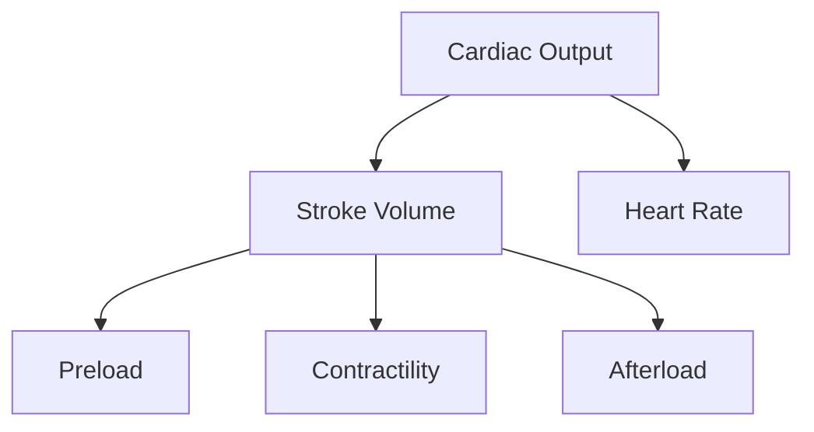

## Cardiovascular and peripheral vascular complications

# Cardiac System

The cardiac system consists of the heart and the blood vessels and is responsible for delivering nutrients to the body and removing waste products.



## Cardiac Output

Cardiac output is the quantity of blood pumped by each ventricle per minute.

### Determinants of CO

## Heart Disease

[^1]

Heart disease is the leading cause of death in the United States. [^2]

## References
[^1]: https://nccd.cdc.gov/DHDSPAtlas/?state=County&class=1&subclass=1&theme=1&filters=[[9,1],[2,1],[3,1],[4,1],[7,1]]&ol=[10,14]
[^2]: Centers for Disease Control and Prevention, National Center for Health Statistics. About Multiple Cause of Death, 1999–2020. CDC WONDER Online Database website. Atlanta, GA: Centers for Disease Control and Prevention; 2022. Accessed February 21, 2022.