## Ischemic Heart Disease

Ischemic heart disease happens when there is an imbalance between myocardial oxygen supply and demand.

Factors contributing to a decreased oxygen supply:

```mermaid
graph TD
    A[↓ O2 Supply] --> D[↓ Oxygen Extraction]
    A --> B[↓ Arterial O2 content]
    A --> C[↓ Coronary Blood Flow]

   D --> E[Left Shift of Oxyhemoglobin disassociation curve]
   D --> F[↓ Capillary density]

   B --> G[Anemia]
   B --> H[Hypovolemia]

   C --> I[↑  Heart Rate]
   C --> J[↓ Aortic Pressure]
   C --> K[↑ End Diastolic pressure]
   C --> L[Coronary Steal]
   C --> M[↓ Vessel Lumen]

   E --> N[Alkalosis]
   E --> O[Hypothermia]
   E --> P[Low levels of 2,3-DPG]

```

For patients with ischemic heart disease undergoing non-cardiac surgery, the Lee Revised Cardiac Index should be used to determine overall risk and help determine if further optimization is necessary.

Metrics used in the score include:
### High Risk Surgery
 - defined as intraperitoneal, intrathoracic, or suprainguinal vascular.
### Coronary Artery Disease
 - defined as History of myocardial infarction, positive exercise test, current complaint of ischemic chest pain or use of nitrate therapy, or ECG with Q waves. Patients with prior CABG surgery or PTCA are included only if they had current complaints of chest pain that are presumed to be due to ischemia
### Congestive Heart Failure
 - defined as: History of congestive heart failure, pulmonary edema, or paroxysmal nocturnal dyspnea; physical examination showing bilateral rales or S3 gallop; or chest radiograph showing pulmonary vascular redistribution
### Cerebrovascular disease
 - defined as: History of transient ischemic attack or stroke
### Diabetes mellitus on insulin
### Serum Creatinine >2 mg/dl or >177 μmol/L

For geriatric patients, the Geriatric-Sensitive Perioperative Cardiac Risk Index is more sensitive.
The GSPCRI includes:
### History of Stroke
### ASA Class
### Surgery Type
### Functional Status
### Creatinine
### History of heart failure
### Diabetes

Clinical risk factors for a perioperative major adverse cardiac event (MACE) include the following[5]:

 - Reduced functional status (< 4 METs)
 - Ischemic heart disease (history of MI, angina pectoris, etc.)
 - Heart failure
 - Cardiomyopathy
 - Severe valvular heart disease (severe aortic stenosis, symptomatic mitral regurgitation)
 - Significant arrhythmias (Mobitz II AV block, 3rd-degree block, symptomatic ventricular arrhythmia, symptomatic bradycardia, newly recognized ventricular tachycardia)
 - Chronic renal failure
 - History of cerebrovascular accident or transient ischemic attack
 - Diabetes mellitus requiring Insulin
 - Chronic pulmonary dysfunction
 - Obesity
 - Anemia

 

 