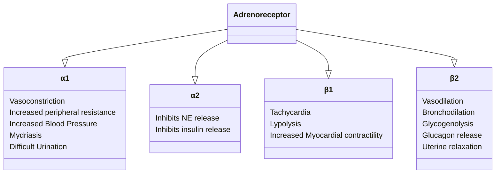
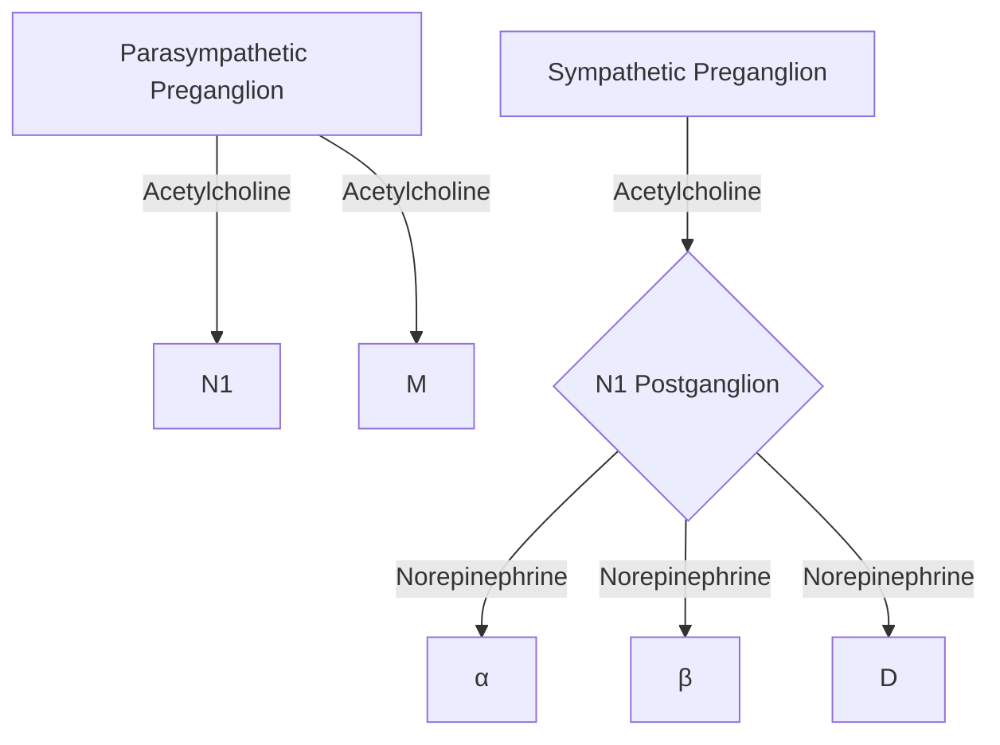

# Autonomic Nervous System

## Function

The ANS provides the body with control over vasculature, secretions, sweat glands, gastrointestinal motility, and temperature.  Depending on the source, it has 2-3 primary divisions being: sympathetic nervous system, parasympathetic nervous system, and (sometimes) the enteric nervous system.  The enteric nervous system is sometimes considered part of the ANS, but for the purposes of this review, I will not discuss it separatey.

## Sympathetic Nervous System

This is known as the "fight or flight" system.  These nerve fibers originate from thoracolumbar region in the spinal cord (T2-L3).  From the spinal cord, these nerves travel to a ganglion usually in the paravertebral region to synapse with a postganglionic nerve that travels to the final destination in the body.  The exception to this rule is the adrenal glands.

{}
1.  Preganglionic fiber  --->  Acetylcholine
2.  Postganglionic fiber --->  Norepinephrine
{}

{}
Postganglionic fibers that innervate sweat glands use Acetylcholine
{}



{}
SNS innervation of the adrenal glands bypasses the ganglion and directly synapses with the adrenal glands!
{}

All other nerves in the SNS follow the short-long idiom.  Specific actions of the SNS include:
- Inhibit bowel movements and urination
- Increast heart rate and contractility
- Increase systemic vascular resistance
- Dilates pupils
- Dilates bronchioles
- Stimulates glucose release



## Parasympathetic Nervous System

The parasympathetic nervous system is sometimes known as the "rest and digest" or "feed and breed" system.  It is responsible for: 
- Sexual Arousal
- Lacrimation
- Salivation
- Urination
- Defecation
- Digestion



The vagus nerve (CN X) gives rise to over 75% of parasympathetic nerves.  These nerves travel directly to the target organ and as such have controlled and discrete responses.

## Adrenergic neurotransmitter synthesis

### Norepinephrine
Synthesis of norepinephrine requires 3 different conversions occuring in the cytoplasm of postganglionic SNS fibers.  Dopaming enters synaptic vesicles where it is converted into norepinephrine.



{}
Exocytosis of norepinephrine is aided by Ca²⁺
{}

Termination of action occurs by:
1. Reuptake (80%)
2. Diffusion from receptor
3. Metabolism (MAO & COMT)

### Common Receptors

