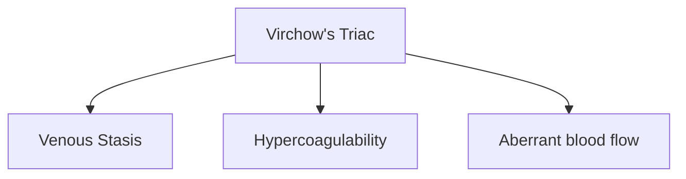

# Geriatrics

A great article on changes with ageing.

<blockquote class="twitter-tweet">
Great work ...Very comprehensive article ....including this novel new graphic for the physiological effects of <a href="https://twitter.com/hashtag/aging?src=hash&amp;ref_src=twsrc%5Etfw">#aging</a>. <a href="https://twitter.com/hashtag/ageing?src=hash&amp;ref_src=twsrc%5Etfw">#ageing</a> <a href="https://twitter.com/hashtag/gerionc?src=hash&amp;ref_src=twsrc%5Etfw">#gerionc</a> <a href="https://twitter.com/hashtag/ASCO18?src=hash&amp;ref_src=twsrc%5Etfw">#ASCO18</a> <a href="https://t.co/XDhSr42hEs">pic.twitter.com/XDhSr42hEs</a>
&mdash; Christopher Steer (@drcbsteer) <a href="https://twitter.com/drcbsteer/status/1002510376741851136?ref_src=twsrc%5Etfw">June 1, 2018</a></blockquote> 

A decrease in cardiac output can delay onset or extend effect of common medications.  A decrease in lean body can increase sensitivity to medications and predispose them to toxic effects.

### Vascular Changes

Arterial Stiffening results in increased afterload and increased myocardial oxygen consumption.
Incidence of venous thromboembolism increases exponentially over age 80 since all aspects of Virchow's triad are affected.

Decreases in baroreceptor function predispose geriatric patients to orthostatic hypotension.  Consider allowing clear liquids up until two hours before surgery.

### Respiratory

Functional Residual Capacity (FRC) increases 5 - 10% per decade of life which decreases vital capacity.  Closing capacity increases more relative to FRC which may predispose these patients to atelectasis, hypoxemia, and increased V/Q mismatch.  Older adults have a reduced respiratory response to hypoxia and hypercapnia and have an increased risk of sleep apnea so pre-operative screening for OSA using the STOP-Bang or similar questionnaire is prudent.

### Renal

Glomerular filtration rate (GFR) decreases about 1 mL/min/m2 per year starting at age 40.  Serum creatinine levels are preserved as lean muscle mass and overall creatinine also decline with advanced age.  Blunted responses to renin, aldosterone, and vasopressin reduce the body's ability to rapidly adjust fluid-volume status and can cause electrolyte disturbances.

### GI/Hepatic

PONV decreases with advanced age.  Multi-modal therapy for PONV prevention may be inappropriate in the elderly as many of these agents can increase the risk of delerium in the elderly.

   <iframe width="560" height="315" src="https://dcri.org/wp-content/uploads/2016/11/2012AGSBeersCriteriaCitations.pdf" title="Beers Criteria" frameborder="0"></iframe>

