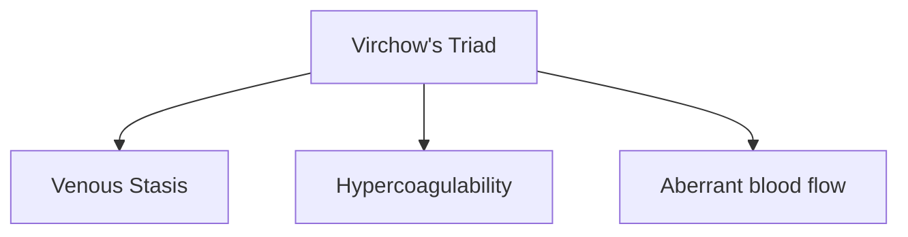

# Geriatrics



A decrease in cardiac output can delay onset or extend effect of common medications.  A decrease in lean body can increase sensitivity to medications and predispose them to toxic effects.

### Vascular Changes

Arterial Stiffening results in increased afterload and increased myocardial oxygen consumption.
Incidence of venous thromboembolism increases exponentially over age 80 since all aspects of Virchow's triad are affected.[^1]

Decreases in baroreceptor function predispose geriatric patients to orthostatic hypotension.  Consider allowing clear liquids up until two hours before surgery.

{}
Allow for adequate hydration and titrate medications carefully to avoid hypo/hypertension.
{}

### Respiratory

Functional Residual Capacity (FRC) increases 5 - 10% per decade of life which decreases vital capacity.  Closing capacity increases more relative to FRC which may predispose these patients to atelectasis, hypoxemia, and increased V/Q mismatch.  Older adults have a reduced respiratory response to hypoxia and hypercapnia and have an increased risk of sleep apnea so pre-operative screening for OSA using the STOP-Bang or similar questionnaire is prudent.[^1]

{}
Ensure neuromuscular blockade is fully reversed to reduce pulmonary complications.
Use OSA screening tool.
{}

### Renal

Glomerular filtration rate (GFR) decreases about 1 mL/min/m2 per year starting at age 40.  Serum creatinine levels are preserved as lean muscle mass and overall creatinine also decline with advanced age.  Blunted responses to renin, aldosterone, and vasopressin reduce the body's ability to rapidly adjust fluid-volume status and can cause electrolyte disturbances.[^1]

{}
Prudent to check electrolytes preoperatively
{}

### GI/Hepatic

PONV decreases with advanced age.  Multi-modal therapy for PONV prevention may be inappropriate in the elderly as many of these agents can increase the risk of delerium in the elderly.[^1]

[Beers Criteria](https://dcri.org/wp-content/uploads/2016/11/2012AGSBeersCriteriaCitations.pdf)

Medication metabolism that is dependent on hepatic extraction (morphine, ketamine, fentanil, sufentanil, lidocaine, flumazenil, etc.) can be delayed considerably[^1]

{}
Titrate drugs carefully and avoid drugs on Beers criteria list when possible.
{}

### Musculoskeletal

Increases in osteoarthritis and loss of lean muscle mass predispose patients to to pressure ulcers and intraoperative nerve injuries.[^1]

{}
Pad joints, bony prominences,  and superficial nerves (ulnar, commmon peroneal, etc.)
{}

### Central Nervous System

Elderly patients are at increased risk of postoperative central nervous system complications. A limited differential includes:  
1.  [Postoperative Cognitive Dysfunction (POCD)](https://www.ncbi.nlm.nih.gov/pmc/articles/PMC3959222/) can arise immediately after surgery and last up to 6 months.[^2]
2.  [Delerium](https://www.ncbi.nlm.nih.gov/pmc/articles/PMC5717753/) can last days to weeks depending on the cause and is usually reversible when the underlying cause is treated.[^3]
3.  [Central anticholinergic syndrome](https://www.ncbi.nlm.nih.gov/pmc/articles/PMC6908498/) can be reversed with the administration of physostigmine[^4]
4.  [Dementia](https://www.ncbi.nlm.nih.gov/pmc/articles/PMC9641180/) can be unmasked with anesthesia[^5]
5.  [Akinetic Crisis](https://www.ncbi.nlm.nih.gov/pmc/articles/PMC6478951/) occurs with the interupption of anti-parkinsonian meds around the time of surgery or the administration of anti-dopaminergic medications such as metoclopramide[^6]

{}
Consider using BIS monitor for dosage titration.  
Consider using cerebral oximetry.  
Reduce MAC as appropriate for age.  
Avoid medications on the [Beers List](https://dcri.org/wp-content/uploads/2016/11/2012AGSBeersCriteriaCitations.pdf)
{}

A great article on changes with ageing.

<blockquote class="twitter-tweet">
Great work ...Very comprehensive article ....including this novel new graphic for the physiological effects of <a href="https://twitter.com/hashtag/aging?src=hash&amp;ref_src=twsrc%5Etfw">#aging</a>. <a href="https://twitter.com/hashtag/ageing?src=hash&amp;ref_src=twsrc%5Etfw">#ageing</a> <a href="https://twitter.com/hashtag/gerionc?src=hash&amp;ref_src=twsrc%5Etfw">#gerionc</a> <a href="https://twitter.com/hashtag/ASCO18?src=hash&amp;ref_src=twsrc%5Etfw">#ASCO18</a> <a href="https://t.co/XDhSr42hEs">pic.twitter.com/XDhSr42hEs</a>
&mdash; Christopher Steer (@drcbsteer) <a href="https://twitter.com/drcbsteer/status/1002510376741851136?ref_src=twsrc%5Etfw">June 1, 2018</a></blockquote> 

## References

[^1]: Praveen Kalra; Miller's Anesthesia, Volumes 1 and 2, 7th Edition.. Anesthesiology 2010; 112:260–261 doi: https://doi.org/10.1097/ALN.0b013e3181c5dc06
[^2]: Rundshagen I. Postoperative cognitive dysfunction. Dtsch Arztebl Int. 2014 Feb 21;111(8):119-25. doi: 10.3238/arztebl.2014.0119. PMID: 24622758; PMCID: PMC3959222.
[^3]: Oh ES, Fong TG, Hshieh TT, Inouye SK. Delirium in Older Persons: Advances in Diagnosis and Treatment. JAMA. 2017;318(12):1161-1174. doi:10.1001/jama.2017.12067
[^4]: López-Álvarez J, Sevilla-Llewellyn-Jones J, Agüera-Ortiz L. Anticholinergic Drugs in Geriatric Psychopharmacology. Front Neurosci. 2019;13:1309. Published 2019 Dec 6. doi:10.3389/fnins.2019.01309
[^5]: Sun M, Chen WM, Wu SY, Zhang J. Dementia risk after major elective surgery based on the route of anaesthesia: A propensity score-matched population-based cohort study. EClinicalMedicine. 2022;55:101727. Published 2022 Nov 4. doi:10.1016/j.eclinm.2022.101727
[^6]: Duma SR, Fung VS. Drug-induced movement disorders. Aust Prescr. 2019;42(2):56-61. doi:10.18773/austprescr.2019.014