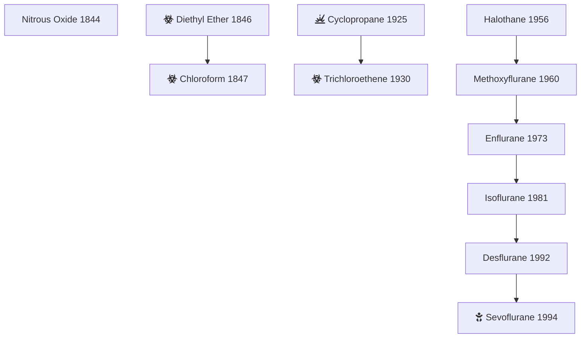

# Overview
Inhalational anesthetics are chemicals that when inhaled can alter consciousness and potentially produce a state of general anesthesia.  Commonly used inhalational anesthetics in the United States are sevoflurane, desflurane, isoflurane, and nitrous oxide.  They produce a dose-dependent depression in the level of consciousness.

## ***History***



## Volatile Inhalational Anesthetics
Volatile anesthetics are liquid at atmospheric pressure and room temperature.  They require a vaporizer to deliver them to the patient which is typically either a variable bypass vaporizer (sevoflurane, isoflurane, halothane) or a gas blender (desflurane).  They produce general anesthesia by ........

## Minimum Alveolar Concentration
Minimum Alveolar Concentration (MAC) is the alveolar concentration at which 50% of patients will not demonstrate a motor response to a standard surgical stimulation.  Individual patient factors will affect this value (see table below).  Further derivations of this value have been estimated for different clinical outcomes. MAC-BAR & MAC-Awake are examples of such derivations.  

{}
MAC-BAR
: The MAC value that blocks autonomic responses to surgical incision in 50% of patients. 
{}
{}
MAC-Awake
: The MAC value that suppresses a voluntary response to verbal command (i.e., eye-opening) in 50% of patients 
{}

## Factors Affecting MAC [^1]

| Factors Increasing MAC | Factors Decreasing MAC|
|-------------|-----:|
| Age < 40      | Age > 40 |
| Chronic ETOH use   | Acute ETOH use |
| Hypernatremia | Hyponatremia |
| Hyperthermia* | Hypothermia* |
| MC1R gene mutation (red hair) | Elderly |
|  | Pregnancy |
|  | Anemia |
|  | Hypercarbia |
|  | Hypoxia  |

\* - Nitrous Oxide not affected by temperature  

## How MAC affects HR

| Agent       | MAC value that ↑ HR  |
|-------------|---------------------:|
| Sevoflurane |                  1.5 |
| Isoflurane  |                  0.5 |
| Desflurane  |                  1.0 |
  

### Isoflurane
```goat
      F     H           F
      |     |           |
      |     |           |
F --- C --- C --- O --- C --- H                     
      |     |           |
      |     |           |
      F     C l         F
```



### Sevoflurane
```goat
    F₃C
        \
         \
    H --- C --- O C H₂F                          
         /
        / 
    F₃C 
```




### Desflurane
```goat              
                        
      F           H     F
      |           |     |    
      |           |     |   
H --- C --- O --- C --- C --- F                     
      |           |     |   
      |           |     |    
      F           F     F    
```



## Non-Volatile Inhalational Anesthetics

### Xenon



### Nitrous Oxide
```goat
                
 N == N == O
      ^
      |                                            
      v
N ≡≡≡ N --- O

```

  

[^1]: Lobo SA, Ojeda J, Dua A, et al. **Minimum Alveolar Concentration.** \[Updated 2022 Oct 19\]. In: StatPearls \[Internet\]. *Treasure Island (FL): StatPearls Publishing;* 2022 Jan-. Available from: [https://www.ncbi.nlm.nih.gov/books/NBK532974/](https://www.ncbi.nlm.nih.gov/books/NBK532974/)