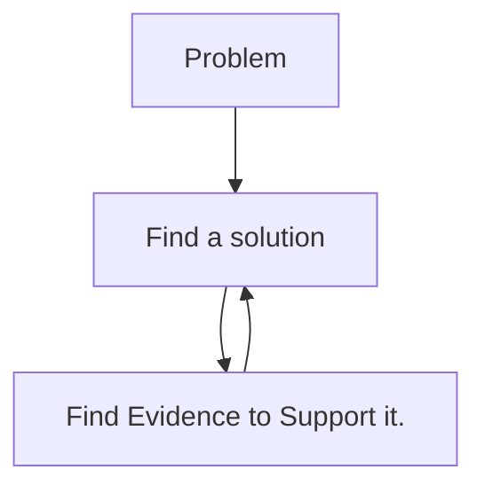

# Definition 

{}
The [Encyclopedia Britannica](https://www.britannica.com/science/confirmation-bias) defines confirmation bias as:

> The tendency to process information by looking for, or interpreting, information that is consistent with one’s existing beliefs.
{}

# Is confirmation bias bad?

Maybe. It seems as if we are aware that we have a confirmation bias or at least might have one then this confirmation bias might be adaptive.[^1]  In other words, it is not necessarily our beliefs that cause the problem, but our stubborn adherence to our beliefs despite of evidence to the contrary. This is a typical search strategy that is used for the novice getting into EBP.  The biases can affect our attention, interpretation, or memory.[^2] [^3]



# Problems with EBP

We have been working in healthcare for a long time and it is all too easy to be solution based in our thinking as the problems we face are often time based.  We have just had a sentinel event and something adverse has happened to our patients or staff.  It is easy to jump to a solution that we know other units or other hospitals are using successfully.  Though, as we know, EBP is not really generalizable.  What works for one area does not necessarily work for another.  If you want to repeat an EBP project, you need to follow the blueprint and repeat the process from inception of the project and that includes the literature search. 

# How to avoid confirmation bias.

 Keeping an open mind is key.  I often see in different blogs and articles that to avoid confirmation bias you should try searching for the antithesis.  Try to prove yourself wrong.  This does help you to acknowledge your own biases but I think, fundamentally, that it colors the spirit of inquiry.  I think a better solution is to spend the majority of your time developing and refining your search strategy.  Reflect on your personal biases and seek out feedback from others.  Consult with a librarian at this point to help you formulate a search strategy.  They are often not subject matter experts on the topic and can help you to see biases that you cannot.

 > “If I had an hour to solve a problem I'd spend 55 minutes thinking about the problem and 5 minutes thinking about solutions.” -Albert Einstein

 When you are anxious to find a solution this can seem tedious and unnecessary, but the time spent at this stage will pay off in the end.  Implementing a suboptimal or unfeasible solution has the potential to erode the confidence in future solutions.  Below is a better process for searching the literature for EBP solutions.  It will help you to follow the evidence instead of justifying proffered solutions.

 ```mermaid
graph TD;
  A[Problem]-->B[Find Evidence for solutions];
  D[Is the evidence high-quality and is it in agreement?]
  B-->D;
  D-->E;
  D-->G[No];
  G-->K;
  E[Yes]-->F[Can you implement this solution?];
  F-->H[Yes];
  H-->I[Implement the solution];
  F-->J[No];
  J-->K;
  K[Rank-order solutions by outcomes and feasibility and select the best one];
  K-->I;
```

The best way to overcome confirmation bias in EBP is being aware that it exists and understanding that you might be wrong about your preconceived notions, your interpretation of the literature, or the feasibility of the solution.  Research is a team sport so develop a multidisciplinary team with diverse backgrounds to help analyze the solution from many different view points.  This will help to develop a solution without significant confirmation bias and keep you grounded in the literature.


[^1]: Rollwage M, Fleming SM. ***Confirmation bias is adaptive when coupled with efficient metacognition.*** *Philos Trans R Soc Lond B Biol Sci*. 2021 Apr 12;376(1822):20200131. [doi: 10.1098/rstb.2020.0131](https://pubmed.ncbi.nlm.nih.gov/33612002/). Epub 2021 Feb 22. PMID: 33612002; PMCID: PMC7935132.
[^2]: Allahverdyan AE, Galstyan A. ***Opinion dynamics with confirmation bias.*** *PLoS One.* 2014;9(7):e99557. doi:10.1371/journal.pone.0099557
[^3]: Frost P, Casey B, Griffin K, Raymundo L, Farrell C, Carrigan R. ***The influence of confirmation bias on memory and source monitoring.*** *J Gen Psychol.* 2015;142(4):238-52. doi:10.1080/00221309.2015.1084987